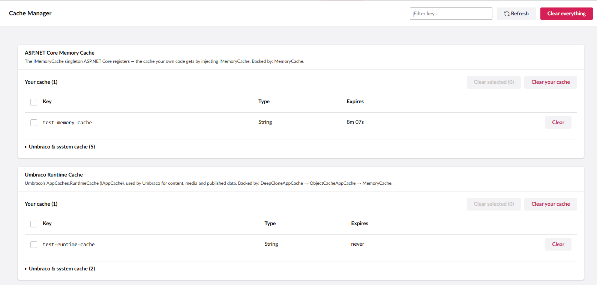

# Umb.CacheManager

A backoffice dashboard for **Umbraco 17** that allows you to view,
inspect, and clear application caches without restarting the website.

## Features

-   View **Umbraco Runtime Cache** and **ASP.NET Core Memory Cache**.
-   View cache keys, cached value types, and expiry information.
-   Live cache expiry countdown.
-   Filter cache entries.
-   Clear individual cache entries.
-   Clear all project-specific cache entries.
-   Clear all application caches.
-   Confirmation before destructive actions.
-   Success and failure notifications in the Umbraco backoffice.
-   Graceful handling when cache entries cannot be enumerated.
-   Configurable project cache key prefixes.
-   Secure API protected by Umbraco backoffice authentication and
    Settings access.

## Supported Cache Stores

  Store                       Source                     Identifier
  --------------------------- -------------------------- ------------
  Umbraco Runtime Cache       `AppCaches.RuntimeCache`   `runtime`
  ASP.NET Core Memory Cache   `IMemoryCache`             `memory`

## Requirements

-   **Umbraco CMS 17**
-   **.NET 10**

## Installation

Install the package using NuGet:

``` powershell
dotnet add package Umb.CacheManager
```

No additional wiring is required. The package automatically registers
its services and installs the backoffice dashboard.

## Usage

After installation, open the Umbraco backoffice and navigate to:

**Settings → Cache Manager**

From here you can view and manage the application's cached entries.

> **Note:** Clearing all caches also clears Umbraco's internal caches.
> The caches will automatically rebuild, but the website may be slower
> temporarily while they are rebuilt.



## Configuration

You can define your own cache key prefixes so the dashboard can
distinguish project-specific cache entries from system caches.

``` json
{
  "CacheManager": {
    "MyKeyPrefixes": [
      "MySite.",
      "MyCompany."
    ]
  }
}
```

You can also configure additional system cache patterns:

``` json
{
  "CacheManager": {
    "SystemKeyPrefixes": [
      "ic:",
      "internal_"
    ],
    "SystemTypeNamespaces": [
      "MyCompany.Internal"
    ],
    "SystemValueTypes": [
      "ImmutableArray<Int32>"
    ]
  }
}
```

If no project prefixes are configured, the package uses automatic
detection to identify common Umbraco and system cache entries.

## Cache Expiry

Where available, the dashboard displays cache expiry information:

-   **Absolute** -- expires at a specific time.
-   **Sliding** -- expiry is extended when the cache is accessed.
-   **None** -- does not expire automatically.
-   **Unknown** -- expiry could not be determined.

## API

The package provides management APIs under:

``` text
/umbraco/management/api/v1/cache-manager
```

  Method     Endpoint    Description
  ---------- ----------- --------------------------------------
  `GET`      `/caches`   Get all cache entries
  `DELETE`   `/key`      Clear a single cache entry
  `DELETE`   `/keys`     Clear multiple cache entries
  `DELETE`   `/custom`   Clear project-specific cache entries
  `DELETE`   `/all`      Clear all cache entries

All API endpoints require Umbraco backoffice authentication and
**Settings section access**.

## Security

Access to the Cache Manager is protected by:

-   Umbraco backoffice authentication.
-   Settings section permissions.
-   `SectionAccessSettings` authorization policy.

Only users with access to the Settings section can use the dashboard and
its APIs.

## Technical Notes

Umbraco and .NET do not provide a public API for enumerating every cache
entry. Therefore, the package uses **guarded reflection** to inspect the
underlying cache stores.

Cache inspection is treated as best-effort. If cache entries cannot be
enumerated, the dashboard displays an appropriate message instead of
causing an application error.

The **Clear All** operation uses the native cache `Clear()`
functionality and does not depend on cache enumeration.

## Support

For issues or feature requests, create an issue in the project's
repository.

## Author

**Giriraj Digital**

## License

This project is licensed under the **MIT License**.
